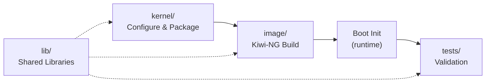

# Telco JeOS Builder


**Telco JeOS Builder** is an automated toolkit for building a custom, highly optimized Just Enough Operating System (JeOS) tailored specifically for Telecommunications and Network Function Virtualization (NFV) workloads.

It orchestrates the process of fetching a vanilla Linux kernel, tuning it for extreme low-latency and high-throughput networking (DPDK, SR-IOV), packaging it into an RPM, and baking it into a minimal QCOW2 virtual machine image using [Kiwi-NG](https://osinside.github.io/kiwi/).

---

## 📑 Table of Contents

- [Features](#-features)
- [Architecture](#-architecture)
- [Prerequisites](#-prerequisites)
- [Quick Start](#-quick-start)
- [Detailed Build Process](#-detailed-build-process)
- [Configuration](#-configuration)
- [Testing & Validation](#-testing--validation)
- [Repository Structure](#-repository-structure)
- [References](#-references)
- [Author](#-author)

---

## ✨ Features

The resulting Telco JeOS image is engineered for maximum performance, featuring:

- **Memory Optimization**: Built-in support for 2MB/1GB HugePages and NUMA-aware memory allocation to drastically reduce TLB misses.
- **Hardware Passthrough**: IOMMU (Intel VT-d/AMD-Vi) and VFIO-PCI readiness for bypassing the kernel networking stack (SR-IOV / DPDK).
- **Virtualization Support**: KVM, virtio, and vhost-net optimized for running Virtual Network Functions (VNFs).
- **Extreme Low-Latency**: Tuned with a fully preemptible kernel (`PREEMPT`), tickless CPUs (`NO_HZ_FULL`), and high-resolution timers.
- **Advanced Networking**: eBPF/XDP support for high-performance packet processing, plus bonding and VLAN capabilities.
- **Telco-Grade Drivers**: Includes optimized drivers for leading enterprise NICs (Intel E810/ICE, XL710/I40E, X520/IXGBE, Mellanox ConnectX).

---

## 🏗 Architecture

The project employs a clean, modular, and component-based architecture:



1. **Kernel Component (`kernel/`)**: Downloads, configures (applying ~70 NFV-specific tweaks), and builds the Linux kernel, outputting a clean RPM.
2. **Image Component (`image/`)**: Defines the OS base and uses Kiwi-NG to install the custom kernel and minimal packages. It overlays runtime configurations onto the root filesystem.
3. **Boot Initialization (runtime)**: A custom systemd service (`telco-nfv-init`) that automatically configures network and memory (HugePages, Sysctl) upon the first boot of the VM.
4. **Validation (`tests/`)**: A comprehensive test suite that verifies kernel parameters, system performance, and module availability.

---

## 📋 Prerequisites

To build the image, you need a Linux host (preferably openSUSE Tumbleweed or SLE) with the following dependencies installed:

```bash
# Core build tools
sudo zypper install make gcc flex bison bc kmod rpmbuild

# Kiwi-NG for image generation
sudo zypper install python3-pip
sudo pip3 install kiwi

# Optional: For linting scripts
sudo zypper install ShellCheck
```

---

## 🚀 Quick Start

Ensure you have the prerequisites installed, then execute the following steps to build your custom image.

```bash
# 1. Download and extract the kernel source (e.g., Linux 6.6.70) into build/kernel/linux-6.6.70
mkdir -p build/kernel
wget https://cdn.kernel.org/pub/linux/kernel/v6.x/linux-6.6.70.tar.xz
tar -xf linux-6.6.70.tar.xz -C build/kernel/

# 2. Configure the kernel for Telco/NFV
make kernel-config

# 3. Compile the kernel and build the RPM package
make kernel-build

# 4. Update the local repository path in image/config.xml (see Configuration below)
# Then build the QCOW2 image (requires sudo)
make image

# 5. Run the validation test suite
make test
```

---

## 🛠 Detailed Build Process

The `Makefile` at the root of the repository controls the build orchestration.

| Target | Description |
|--------|-------------|
| `make help` | Show available targets and environment variables. |
| `make kernel-config` | Interactively applies the optimal Telco/NFV configuration via `scripts/config`. |
| `make kernel-build` | Compiles the kernel (`-j$(nproc)`), installs modules to a staging area, and wraps them in an RPM using `rpmbuild`. |
| `make image` | Uses Kiwi-NG to construct the final QCOW2 virtual machine image, injecting the custom kernel and filesystem overlays. |
| `make test` | Executes the comprehensive test suite to validate the kernel and build process. |
| `make lint` | Runs `shellcheck` across all bash scripts in the repository. |
| `make clean` | Removes all artifacts in the `build/` directory. |

*Note: You can override the default kernel version by passing it to make: `make kernel-config KERNEL_VERSION=6.6.80`*

---

## ⚙️ Configuration

### 1. Build-Time (Kernel)
Kernel options are strictly defined in `kernel/configure-telco-kernel.sh`. For a detailed explanation of why each parameter is selected, refer to [`kernel/kernel-features.md`](kernel/kernel-features.md).

### 2. Image-Time (Kiwi)
Before running `make image`, you must point Kiwi to the RPM repository containing your newly built kernel.
Edit `image/config.xml` and update the local repository path:

```xml
<repository type="rpm-md" alias="telco-kernel-local" priority="0">
    <source path="dir:///path/to/your/telco-jeos-builder/build/kernel/rpmbuild/RPMS/x86_64/"/>
</repository>
```
*Don't forget to run `createrepo_c` on your RPMS directory if you modify packages manually.*

### 3. Run-Time (Deployed OS)
Upon booting the QCOW2 image, the `telco-nfv-init` service will configure the system. You can customize its behavior by editing `/etc/telco-nfv/config` inside the VM (or via the overlay at `image/root/etc/telco-nfv/config` before building):

```bash
# /etc/telco-nfv/config
HUGEPAGES_2M=1024        # Reserve 2GB for DPDK
NET_MODE="dhcp"          # Use "dhcp" or "static"
NET_IFACE="eth0"         # Target network interface
TELCO_MODULES="vfio vfio-pci vhost_net" # Modules to load
```

---

## 🧪 Testing & Validation

The project includes a robust test script (`tests/telco-kernel-test.sh`) to ensure the resulting image meets Telco-grade standards.

```bash
# Run all tests
make test
```

The test suite evaluates four main areas:
1. **Suite A (Config Verification)**: Statically parses the `.config` to guarantee all DPDK/SR-IOV flags are set.
2. **Suite B (Runtime Verification)**: Verifies active memory (HugePages), NUMA topology, and loaded modules on the live system.
3. **Suite C (Performance Benchmarks)**: Compares the custom kernel size and module footprint against standard kernels.
4. **Suite D (Integration Tests)**: Checks for the existence and syntax validity of all required overlay files and scripts.

---

## 📂 Repository Structure

```text
.
├── Makefile                    # Build orchestration
├── lib/                        # Shared Bash libraries
│   ├── logger.sh               #   Structured logging
│   ├── utils.sh                #   Common utilities
│   └── config.sh               #   Centralized defaults
│
├── kernel/                     # Kernel configuration & packaging
│   ├── configure-telco-kernel.sh
│   ├── kernel-telco-nfv.spec
│   └── kernel-features.md
│
├── image/                      # Kiwi-NG image definition
│   ├── config.xml              #   Image specification
│   ├── config.sh               #   Post-install script
│   └── root/                   #   Filesystem overlay
│       ├── etc/telco-nfv/config
│       ├── etc/sysctl.d/90-telco-nfv.conf
│       ├── etc/modules-load.d/telco-nfv.conf
│       ├── etc/systemd/system/telco-nfv-init.service
│       └── usr/local/bin/telco-nfv-init.sh
│
├── tests/                      # Validation & linting
│   ├── telco-kernel-test.sh
│   └── shellcheck.sh
│
├── docs/                       # Documentation
│   └── architecture.md
│
└── build/                      # Build outputs (.gitignored)
    ├── kernel/                 #   Kernel source, RPMs
    └── image/                  #   QCOW2 image
```

---

## 📚 References

- [Linux Kernel Documentation](https://www.kernel.org/doc/html/latest/)
- [DPDK System Requirements](https://doc.dpdk.org/guides/linux_gsg/sys_reqs.html)
- [Kiwi-NG Documentation](https://osinside.github.io/kiwi/)
- [Red Hat Virtualization Tuning and Optimization Guide](https://access.redhat.com/documentation/en-us/red_hat_enterprise_linux/7/html/virtualization_tuning_and_optimization_guide/)

---

## 👤 Author

**Hung Anh To**  
Ascent Cloud Engineer Lab @ Ericsson  
Email: anh.to@ericsson.com | hunganh1310.work@gmail.com
