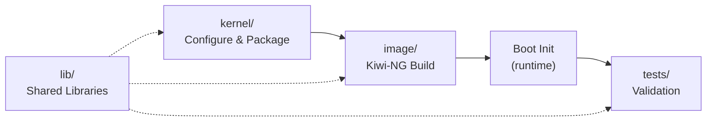

# Architecture — Telco JeOS Builder

## Component Overview

The Telco JeOS Builder produces a minimal QCOW2 image optimized for NFV workloads. It is composed of four independent, composable components:

### 1. `kernel/` — Kernel Configuration & Packaging

**Purpose**: Automate the configuration of a vanilla Linux kernel with Telco/NFV-specific options, then package it as an RPM.

**Data flow**:
- Input: Vanilla kernel source (e.g., `linux-6.6.70.tar.xz`)
- Process: `configure-telco-kernel.sh` applies ~70 kernel config options
- Output: `kernel-telco-nfv-6.6.70-1.x86_64.rpm`

### 2. `image/` — Kiwi-NG Image Definition

**Purpose**: Define a minimal OS image that includes the custom kernel and all necessary runtime configuration.

**Data flow**:
- Input: `config.xml` (package list + image format), `config.sh` (post-install), `root/` (filesystem overlay)
- Process: Kiwi-NG builds the image, installs packages, runs post-install, applies overlay
- Output: `telco-jeos.x86_64-1.0.0.qcow2`

The `root/` overlay provides a single source of truth for all runtime configuration files:
- `etc/telco-nfv/config` — Runtime parameter overrides
- `etc/sysctl.d/90-telco-nfv.conf` — Network/memory tuning
- `etc/modules-load.d/telco-nfv.conf` — Kernel modules to load
- `etc/systemd/system/telco-nfv-init.service` — Boot-time service
- `usr/local/bin/telco-nfv-init.sh` — Boot-time initializer script

### 3. Boot-Time Initialization (runtime)

**Purpose**: At first boot, configure HugePages, network, load kernel modules, apply sysctl tuning, and verify IOMMU/CPU isolation.

**Execution order**:
1. `systemd-modules-load` loads modules from `telco-nfv.conf`
2. `systemd-sysctl` applies tuning from `90-telco-nfv.conf`
3. `telco-nfv-init.service` runs `telco-nfv-init.sh`

### 4. `tests/` — Validation

**Purpose**: Verify that kernel config, runtime state, and component integration are correct.

Four test suites:
- **Suite A**: Offline `.config` analysis (runs anywhere)
- **Suite B**: Runtime verification (runs on deployed image)
- **Suite C**: Performance benchmarks (size, module count)
- **Suite D**: Integration tests (all components present and linked)

### 5. `lib/` — Shared Libraries

**Purpose**: Eliminate code duplication across scripts.

- `logger.sh` — Structured logging with color, file output, and systemd journal integration
- `utils.sh` — Root checks, dependency validation, idempotency helpers, cleanup traps
- `config.sh` — Centralized defaults and config override loading

## Design Decisions

| Decision | Rationale |
|----------|-----------|
| Single `image/root/` overlay | Eliminates 3-way duplication of boot script and configs |
| Separate sysctl/modules-load files | Leverages systemd's native conf.d mechanism instead of inline heredocs |
| `--dry-run` on boot script | Enables safe testing without modifying system state |
| RPM spec uses `%{_topdir}` | Removes hardcoded paths, works in any build environment |
| `lib/` sourced by all scripts | Consistent logging, error handling, and config across the project |
| `build/` directory gitignored | Keeps repo clean; all artifacts are reproducible |
